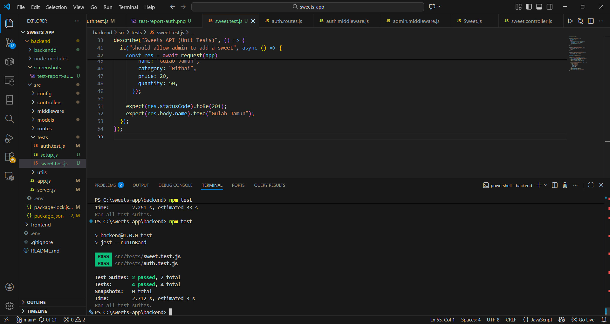

🍬 Sweet Shop Management System (TDD Kata)

A full-stack Sweet Shop Management System built as part of a TDD kata, demonstrating backend API design, frontend SPA development, authentication, role-based access control, automated testing, and responsible AI usage.

🚀 Tech Stack
Backend

Node.js

Express.js

MongoDB (MongoDB Atlas)

JWT Authentication

Jest + Supertest (Testing)

Frontend

React

React Router

Axios

Context API

Tools

Git & GitHub

Postman

VS Code

✨ Features
👤 Authentication

User Registration

User Login

JWT-based authentication

Role-based access (User / Admin)

🍭 Sweets Management

View all sweets

Search sweets by name, category, price range

Purchase sweets (quantity decreases)

Purchase button disabled when stock is 0

🛠️ Admin Features

Add new sweets

Update sweet details

Delete sweets

Restock sweets

📁 Project Structure
sweets-app/
│
├── backend/
│   ├── src/
│   │   ├── controllers/
│   │   ├── models/
│   │   ├── routes/
│   │   ├── middleware/
│   │   ├── tests/
│   │   └── app.js
│   ├── screenshots/
│   └── package.json
│
├── frontend/
│   ├── src/
│   │   ├── pages/
│   │   ├── context/
│   │   ├── components/
│   │   └── App.js
│   └── package.json
│
└── README.md

⚙️ Setup Instructions
1️⃣ Clone the Repository
git clone https://github.com/<your-username>/sweets-app.git
cd sweets-app

2️⃣ Backend Setup
cd backend
npm install

Create a .env file:

PORT=5000
MONGO_URI=your_mongodb_atlas_uri
JWT_SECRET=your_secret_key

Run backend:

npm run dev

Backend runs on:

http://localhost:5000

3️⃣ Frontend Setup
cd ../frontend
npm install
npm start

Frontend runs on:

http://localhost:3000

🧪 Test-Driven Development (TDD Evidence)
🧠 Testing Strategy

Unit tests written using Jest and Supertest

Database layer mocked to avoid flaky integration tests

Business logic and API contracts verified

Role-based access tested (User vs Admin)

📌 Test Coverage

Authentication API

Sweets API

Inventory (Purchase & Restock)

▶️ Run Tests
cd backend
npm test

✅ Test Results

All test suites pass successfully.

📸 Test Report Screenshot:

📷 Application Screenshots
🔐 Login Page

📝 Register Page

🍬 User Dashboard

🛠️ Admin Controls

(Add your screenshots in the screenshots/ folder and update paths if needed.)

🤖 My AI Usage

AI tools were used responsibly and transparently during development.

🧠 Tools Used

ChatGPT

🛠️ How AI Helped

Generating initial boilerplate code

Debugging backend issues

Designing API structure

Writing unit tests

Improving README documentation

✍️ What I Did Myself

Implemented full application logic

Designed frontend UI and state management

Integrated backend & frontend

Fixed bugs surfaced by tests

Ensured role-based access control

Verified application manually using Postman & UI

🔍 Reflection

AI significantly improved productivity by speeding up repetitive tasks and offering debugging guidance. However, all core decisions, integration, and final implementation were done manually, ensuring full understanding and ownership of the code.

📦 Deliverables Checklist

✔ Public GitHub repository
✔ Backend REST API
✔ Frontend SPA
✔ Authentication & Authorization
✔ Automated Tests
✔ Test Report
✔ Screenshots
✔ AI Usage Disclosure

🌟 Optional Enhancements

Deployment on Vercel / Netlify / Render

CI pipeline with GitHub Actions

Improved UI styling

👤 Author

Harsh Raj

🏁 Final Note

This project demonstrates real-world full-stack development, clean coding, testing discipline, and ethical AI usage.

✅ Submission-ready
🚀 Interview-ready

